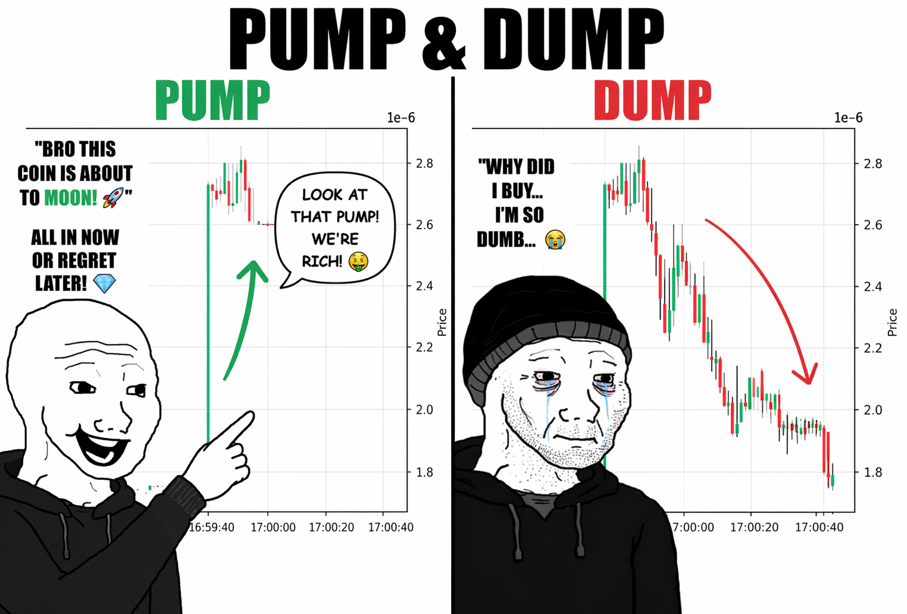
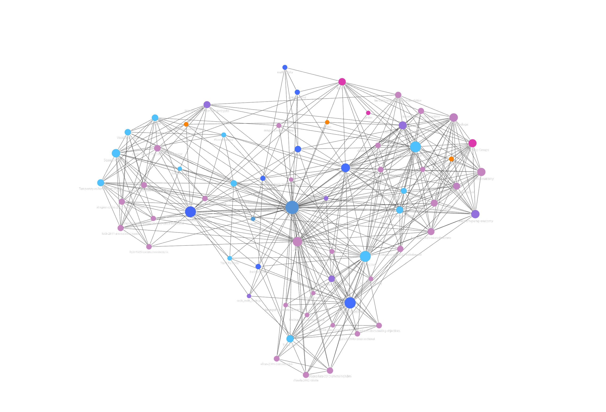

# Mitigating Class Imbalance in Pump-and-Dump Detection

A Comparative Analysis of Imbalance-Aware Algorithms on Binance P&D events.

<p align="center">
  
</p>

## What is a pump-and-dump?

A pump-and-dump (P&D) is a coordinated market-manipulation scheme. Organizers accumulate a cheap, thinly traded asset in advance, then a Telegram/Discord channel broadcasts a synchronized "buy now" signal to thousands of followers at a pre-announced timestamp. The sudden demand spike (the **pump**) inflates the price within seconds. Insiders sell into that retail bid, collapsing the price over the next few minutes (the **dump**) and leaving late buyers with losses. In crypto these schemes target low-cap Binance tokens because order books are shallow enough for a few thousand USDT of coordinated flow to move the mid-price by 5% or more in under a minute.

The image above shows a real test-set event from our dataset: a 4% jump at the announcement (left panel) followed by a 30% drawdown within 40 seconds (right panel).

The detection task in this repository is the **target-prediction** variant: given an announcement is about to happen, rank all ~290 BTC-quoted pairs on Binance by their probability of being the manipulation target, using only microstructure signals observable one hour *before* the announcement (order-flow imbalance, slippage, volume z-scores, lifetime prior-pump count). This is an extreme-imbalance cross-sectional classification problem (1 positive per ~290 negatives), which is the reason class-imbalance handling drives most of the modeling choices below.

## About this project

This repository contains the code, data manifests, and experiments backing the IEEE Access submission *"Mitigating Class Imbalance in Pump-and-Dump Detection"* (Access-2026-02451). It predicts which ticker in a given cross-section is the pump target, using microstructure features and ranking-aware learning on a panel with a negative/positive imbalance ratio of 154–291 (train → test).

## Highlights

- **Problem.** For each announced P&D event on Binance, pick the manipulated ticker out of the full cross-section of BTC-quoted pairs active at that time (train avg. 155, validation 236, test 292 candidates per event).
- **Dataset.** 359 labeled Binance BTC-pair pump events after filtering (Dec 2018 – Mar 2024), split into 227 train / 74 validation / 58 test positives.
- **Approach.** Cross-sectionally standardized microstructure features + CatBoost classifier with `Top@K%-AUC` early stopping, evaluated against Logistic Regression, Random Forest, CatBoost Ranker, and CatBoost + SMOTE baselines.
- **Execution-aware backtest.** Square-root market-impact model (Tóth / Donier–Bonart) fitted per asset from trade-level candles (5-min pre-pump entry, 5-sec sell-only post-pump exit), translated into size-dependent VWAP slippage.

## Main Results

Evaluation on 58 held-out P&D cross-sections (test period > 2021-05-01).

### Top@K accuracy (test set)

| Model                         | Top@1  | Top@2  | Top@5  | Top@10 | Top@20 | Top@30 |
|-------------------------------|:------:|:------:|:------:|:------:|:------:|:------:|
| Logistic Regression + Tuned   | 0.155  | 0.190  | 0.345  | 0.552  | 0.707  | 0.759  |
| Random Forest + Tuned         | 0.155  | **0.259** | 0.362  | 0.517  | 0.655  | 0.793  |
| CatBoost Classifier + Tuned   | **0.190** | 0.241  | **0.379** | 0.534  | 0.707  | 0.793  |
| CatBoost + SMOTE + Tuned      | 0.086  | 0.121  | 0.259  | 0.414  | 0.552  | 0.638  |
| CatBoost Ranker + Tuned       | 0.086  | 0.138  | 0.190  | 0.397  | 0.517  | 0.569  |
| **CatBoost + TOPKAUC ES**     | **0.190** | 0.224  | **0.379** | **0.569** | **0.724** | **0.810** |

### Top@K%-AUC with 95% bootstrap CIs

Top@K%-AUC is integrated and normalized over the low-K% region K% ∈ (0, 20%], so it isolates the selective, economically relevant regime. Intervals are cross-section-level bootstrap (1000 iterations).

| Model                          | Top@K%-AUC | 95% CI             |
|--------------------------------|:----------:|:------------------:|
| CatBoost Classifier + Tuned    | 0.720      | [0.634, 0.794]     |
| **CatBoost + TOPKAUC ES**      | **0.729**  | **[0.644, 0.807]** |

### Portfolio performance (CatBoost + TOPKAUC ES, 25 bps round-trip, no reinvestment)

| K  | Avg. trade return | Annualized return | Annualized vol. | Sharpe |
|:--:|:-----------------:|:-----------------:|:---------------:|:------:|
| 1  | 0.0766 | 3.0801 | 1.1345 | 2.71 |
| 2  | 0.0473 | 1.9019 | 0.6350 | 3.00 |
| 5  | 0.0310 | 1.2477 | 0.3641 | 3.43 |
| 10 | 0.0210 | 0.8449 | 0.2206 | 3.83 |
| 20 | 0.0136 | 0.5455 | 0.1353 | **4.03** |
| 30 | 0.0084 | 0.3392 | 0.0883 | 3.84 |

Under the fitted square-root impact model, cumulative ROE for a K=5 portfolio declines monotonically from 2.45 at 100 USDT intended order size to 1.65 at 10,000 USDT, so the edge survives retail-scale execution but would require TWAP/VWAP splitting at larger notionals. A BTC buy-and-hold baseline over the same event windows delivers an annualized return of −0.431 (Sharpe −0.66).

### Key findings

1. **Cross-sectional standardization matters.** Every learned model beats the random baseline at every K; the signal is in the engineered microstructure features, not just the model.
2. **Top@K%-AUC early stopping wins at the point estimate.** Using Top@K%-AUC over (0, 20%] as the early-stopping objective (rather than log-loss or standard AUC) raises test Top@K%-AUC from 0.720 to 0.729 and dominates Top@K accuracy at K ∈ {10, 20, 30} where cumulative separation is largest.
3. **SMOTE fails here.** Synthetic oversampling in this high-dimensional, cross-sectionally standardized panel *degrades* performance at every Top@K threshold (tuned SMOTE reaches only 0.086 Top@1 vs 0.190 for the class-weighted classifier), a cautionary tale against applying imbalance tricks uncritically. Root causes: bounded sign-meaningful features, cross-sectional reference violated by nearest-neighbor interpolation across events, and high-dimensional sparsity with only 227 training positives.
4. **Ranker underperforms classifier.** The CatBoost Ranker (YetiRank) reaches only 0.086 Top@1 despite the task being ostensibly a ranking problem. In a 1-vs-~290 cross-section, most pairwise gradient mass is negative-vs-negative noise; class-weighted log-loss concentrates gradient on the actually relevant decision boundary.
5. **Statistical significance is not established on the paired test.** Paired bootstrap of TOPKAUC ES vs. CatBoost Classifier + Tuned gives an observed Top@K%-AUC difference of 0.009 with 95% CI [−0.017, 0.035] and a one-sided p-value of 0.250. Tables above should be read as a ranking of point estimates consistent with the baseline within sampling noise; we explicitly avoid overclaiming.
6. **Robustness.** Retraining on random 70% subsets of the training set yields σ(Top@K%-AUC) = 0.017 (80% in [0.683, 0.729]). The early test subperiod (May 2021 – Jun 2022, 55 events) scores 0.737, essentially indistinguishable from the full-test 0.729; the late subperiod (Jul 2022 – Mar 2024) contains only 3 events and is excluded via a `min_pumps=10` guard.

The full manuscript is in [`paper/access.pdf`](paper/access.pdf) with a latexdiff-highlighted revision version in [`paper/access_highlighted.pdf`](paper/access_highlighted.pdf).

---

## Reproducibility Guide

### 1. Environment

```bash
# Python 3.13 with Poetry
poetry install
```

All subsequent commands assume `poetry run` prefixes (or an activated `poetry shell`).

### 2. Dataset layout

Datasets are expected under `/data/pumps/data/` (configurable in `core/paths.py`):

```
/data/pumps/data/
├── raw/
│   └── binance/spot/trades/       # daily .zip from data.binance.vision
├── transformed/
│   └── binance/spot/trades/       # HIVE-partitioned parquet
├── features/                      # per-pump feature parquets
└── studies.db                     # Optuna SQLite
```

Make sure this directory exists and is writable before running the pipeline.

### 3. Get the P&D event labels

Already checked in:

- `resources/pumps.json` — 175 Telegram-curated events (Dec 2018 – Apr 2024) plus 1111 events from La Morgia et al. 2020/2021, filtered by our inclusion criteria (ticker identification, ±5 min announcement regularity, 5%/3× price-volume verification). Candidates that failed any criterion were dropped, leaving 359 valid Binance BTC-pair events.

No action needed for this step; the JSON file is versioned.

### 4. Download raw trade data from Binance

Binance publishes complete tick-level history at [data.binance.vision](https://data.binance.vision) under the `data/spot/daily/trades/<PAIR>/` prefix (daily aggregated-trades `.zip` files). We use the archive (not the REST API) because it is immutable, complete, and carries buy/sell flags needed for microstructure features.

Run the scraper to populate `raw/binance/spot/trades/`:

```bash
poetry run python -m market_data.parsers.binance.BinanceSpotTradesParser
```

This iterates all BTC-quoted pairs that appear in `resources/pumps.json` (+/- a buffer window for feature offsets) over the date range covered by the event list. Expect several hundred GB of raw zip files and a multi-hour run on a decent connection. Adjust `Bounds.for_days(...)` in `run_main()` if you want a smaller re-run.

### 5. Convert raw zips to HIVE-partitioned parquet

```bash
poetry run python -m preprocessing.run
```

This walks `raw/binance/spot/trades/` and writes `transformed/binance/spot/trades/<pair>/<date>.parquet`. The HIVE layout enables cheap per-day / per-pair scans with Polars.

### 6. Build features

```bash
poetry run python -m features.FeatureWriter
```

For each pump event in `resources/pumps.json`, this materializes the cross-section (all tickers active within the relevant window) and computes microstructure features (asset returns, flow imbalance, slippage, aggressor imbalance, number of trades, etc.) at multiple offsets from 5 min to 14 days before the announcement. Output: one parquet per event under `/data/pumps/data/features/`.

CPU-parallel via `run_parallel(cpu_count=...)`.

### 7. Train models and run the full comparison

The training notebook `notebooks/research_notebook.ipynb` orchestrates the full experiment:

```bash
poetry run jupyter lab
# open notebooks/research_notebook.ipynb, run all
```

Under the hood the notebook uses the pipelines in `backtest/pipelines/`:

- `LogisticRegression` — class-weighted baseline
- `RandomForest` — tuned baseline
- `CatboostClassifier` — tuned CatBoost classifier
- `CatboostClassifierSMOTE` — CatBoost with SMOTE oversampling
- `CatboostClassifierTOPKAUC` — CatBoost with `Top@K%-AUC` early stopping (our best model)
- `CatboostRanker` — learning-to-rank baseline

Each pipeline handles: data split (train < 2020-09-01, val 2020-09-01 to 2021-05-01, test > 2021-05-01), cross-sectional standardization, Optuna hyperparameter tuning (30 trials), training, and scoring. Results and plots land in `notebooks/analysis_outputs/` and `notebooks/images/`.

### 8. Portfolio simulation and price-impact backtest

`notebooks/visualisations.ipynb` builds the top-K portfolio under the fitted square-root impact model and produces the plots in Section IV of the paper. The impact model is fitted per asset from trade-level candles; VWAP slippage for size Q is `I_vwap(Q) = (2/3) * β * sqrt(Q)`.

### 9. Compile the paper

```bash
just paper          # builds paper/access.pdf
```

Or the highlighted revision version:

```bash
cd paper && pdflatex -interaction=scrollmode access_highlighted.tex
```

---

## Code Map

| Module           | What it owns                                                                 |
|------------------|------------------------------------------------------------------------------|
| `core/`          | Shared types (`PumpEvent`, `CurrencyPair`, `FeatureType`), paths, time utils |
| `market_data/`   | Scrapy-based Binance archive scraper                                         |
| `preprocessing/` | Raw `.zip` → HIVE-partitioned Parquet                                        |
| `features/`      | `PumpsFeatureWriter`: per-event cross-section feature materialization        |
| `backtest/pipelines/` | ML model implementations (all extend `BasePipeline`)                   |
| `backtest/portfolio/` | Execution simulation, price-impact model, VWAP slippage                |
| `backtest/utils/` | Dataset building, evaluation metrics, robustness testing                    |
| `notebooks/`     | Experiment orchestration + paper figures                                     |
| `paper/`         | IEEE Access LaTeX sources                                                    |
| `knowledge-base/`| Obsidian wiki with research notes and decisions                              |
| `resources/`     | Event labels (`pumps.json`)                                                  |

## Development Commands

```bash
just format-all     # black (120-char lines)
just pylint         # lint
just mypy           # type checks
poetry run pytest -q
```

---

## Knowledge Base



The `knowledge-base/wiki/` folder is an Obsidian vault that documents the research rationale, all ingested papers, domain concepts, and codebase decisions behind this project. It contains 60+ interlinked markdown pages covering every model choice, dataset, and microstructure concept used in the paper. The graph above is the Obsidian-rendered link structure: central hubs (`index`, `backtest-portfolio`, `backtest-pipelines`, `Cross-Section`, `Pump-and-Dump Scheme`) connect to paper summaries (lavender), concept pages (cyan), module pages (blue), entities (magenta), and open-gap notes (orange).

The knowledge base is structured as:

```
knowledge-base/wiki/
├── index.md                      # master page catalog
├── overview.md                   # project summary
├── concepts/                     # Cross-Section, Flow Imbalance, Top-K AUC, etc.
├── entities/                     # Binance, Telegram Pump Groups
├── modules/                      # one page per code module
├── papers/                       # one summary page per ingested paper
├── thesis/                       # synthesis pages: survey, impact models, code audit
└── gaps/                         # open empirical questions
```

You can use Claude Code to get a conversational interface to this knowledge: ask why SMOTE failed, how the square-root impact model is parameterized, what the prior literature says about cross-section ranking, or what bugs the code audit found.

---

## Using Claude Code with the Knowledge Base

[Claude Code](https://claude.ai/code) runs as a terminal agent with direct read access to the repository. It can cross-reference the wiki and the source code in the same conversation without any file upload step.

```bash
# Install Claude Code
npm install -g @anthropic-ai/claude-code

# Launch from the project root
cd /path/to/pumps_and_dumps
claude
```

Because Claude Code can read any file in the repo, you can ask questions that span both the wiki and the code:

```
Read knowledge-base/wiki/thesis/code_audit_findings.md and then open
backtest/utils/evaluation.py. Confirm whether the use_price_impact flag
bug described in the audit is still present in the current code.
```

```
Read knowledge-base/wiki/concepts/Cross-Section.md and then show me
exactly where the cross-section is constructed in backtest/utils/sample.py.
```

The `CLAUDE.md` file at the project root already configures Claude Code with the relevant conventions (module layout, type-hint style, test paths) and routes scoped work to the project's subagents (`research`, `developer`, `python-analyst`), so you do not need to re-explain the project structure.

### Why query the wiki, not just the code

The code tells you *what* happens; the wiki tells you *why*. Design rationale, rejected alternatives, literature context, statistical caveats, and code-audit findings are not reconstructible from `git log` or source. Grounding the LLM in both lets it answer "why did we pick this?" instead of only "what does this function do?", and keeps it from re-deriving conclusions the project has already settled.

Example questions that need the wiki:

```
Explain why SMOTE fails in this project. What is the cross-section
structure violation and why is it a problem?
```

```
What is the most critical bug found in the backtest code audit and which
table in the paper is affected?
```

---

## Citation

If you use this work, please cite the IEEE Access paper (citation block will be added once the DOI is final; in the meantime, cite this repository).

## License

See `LICENSE` (to be added).
